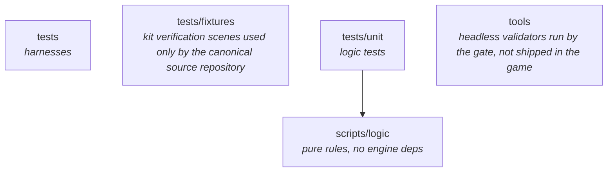

# Architecture

Two sections. The diagram below is **generated from the code** by `arch.py` and
verified by `kit verify --stage arch`, so it cannot drift. The prose after it
is hand-written and explains *why* the boundaries exist, which is the only thing
the code cannot express.

Do not hand-edit inside the generated markers, and do not restate constants,
counts or file inventories anywhere in this document. If a fact could be
contradicted by a grep, it does not belong here.

Regenerate with:

```
kit architecture update
```

## Module graph

<!-- BEGIN GENERATED GRAPH -->



<!-- END GENERATED GRAPH -->

## Why these boundaries

**`scripts/logic` depends on nothing but `scripts/data`.**
Pure `RefCounted` rules with no `Node`, no scene, no autoload, no engine
singleton. This is the only code an agent can write and fully verify on its own,
headlessly, in milliseconds. Everything that touches a node needs a human to
judge it. The boundary is therefore not aesthetic: it is the line between work
that can be automated and work that cannot. Push as much across it as possible.

It is also the C++ escape hatch. A module with no engine dependencies is a
module you can port to GDExtension when a profiler names it, without untangling
it from the scene tree first.

**`scripts/data` depends on nothing.**
Typed configuration and serialisation formats. Flat primitives only, so the
shape maps directly onto a C++ struct or an ECS singleton component. Config is
*injected* into logic, never reached out to via a global. A global lookup inside
a hot loop becomes a per-call boundary crossing the moment that loop moves to
native code, and that cost is what makes naive GDExtension ports slower than the
GDScript they replaced.

**`scripts` (the node layer) may depend on both, and nothing may depend on it.**
Wiring and presentation. Reads input, calls into logic, renders the result. Thin
by construction. If a rule ends up here, it has escaped the testable half of the
codebase.

**Tests reach into logic and data directly.**
No scene instantiation, no engine loop, so unit tests stay fast enough to run on
every single edit.

## Enforcement

`arch.rules.json` declares which module may depend on which. It is the source of
truth for what is *allowed*; the code is the source of truth for what *is*. The
gate compares the two and fails on any edge that is not declared, plus any
reference to an autoload from `scripts/logic/` or `scripts/data/` inside the
configured game root.

A module not listed in `arch.rules.json` is drawn but not constrained, so new
directories can be added freely and tightened later.

## Layout: why this differs from common practice

Community practice usually groups by feature — `entities/player/` holding that
entity's scene, script and art together. This kit recommends layer folders
inside the configured game root instead (`scripts/logic/`, `scripts/data/`,
and `scripts/`).

That is a deliberate trade, not a claim that feature folders are wrong. The
logic-versus-data split is the one boundary a machine can check: the `types`
stage uses it to catch untyped external data before it spreads, which is the
single most expensive class of error observed with agent-written GDScript.

**Feature folders inside a layer are fine and encouraged at scale** —
`scripts/logic/items/`, `scripts/logic/movement/`. Group data with the system
that owns it. The boundary is between layers, not between features.

**Reorganising entirely is supported.** `arch.rules.json` declares both the
module graph and `type_boundary.interior` / `.boundary`, so you can rename or
restructure freely and the checks follow. Nothing about the layout is hardcoded
in a gate file.
