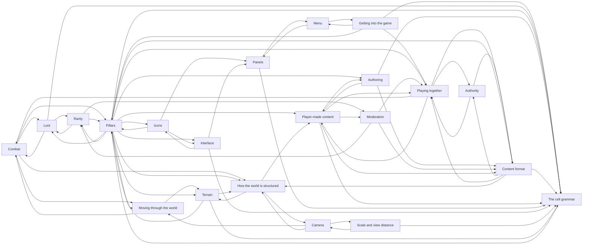

# Design index

Generated by `tools/design.py`. Do not edit.

One line per section. Read this to find the right document, then open only
that document. Do not load the whole design body into context.

## Sections

| Section | Resolution | What it is about |
|---|---|---|
| [Combat](combat/combat.md) | question | You fight things.  |
| [Getting into the game](frontend/frontend.md) | direction | You launch and you are one click from playing.  |
| [Menu](frontend/menu.md) | direction | The first screen is quiet.  |
| [Loot](loot/loot.md) | direction | You see something on the ground and you have a rough idea what it is before you pick it up.  |
| [Rarity](loot/rarity.md) | direction | A rare thing looks rare from across the room, and it does not look rare by being brighter. |
| [Camera](movement/camera.md) | direction | The view follows you without you thinking about it.  |
| [Moving through the world](movement/movement.md) | settled | You hold a direction and the character goes that way.  |
| [Authority](multiplayer/authority.md) | direction | Two players see the same thing happen.  |
| [Playing together](multiplayer/multiplayer.md) | direction | You play with a few friends.  |
| [Pillars](pillars.md) | settled | Four things this game commits to.  |
| [Authoring](ugc/authoring.md) | direction | You are standing in the world, you open an editor, and you place things.  |
| [Content format](ugc/format.md) | direction | You can open a map file and read it.  |
| [Moderation](ugc/moderation.md) | question | Content arrives from people you do not know.  |
| [Player-made content](ugc/ugc.md) | direction | Someone builds a dungeon and you play it.  |
| [Icons](ui/icons.md) | direction | An icon looks like a small version of the thing it means, not a symbol you had to learn.  |
| [Panels](ui/panels.md) | direction | A panel feels like a piece of the world folded into a frame.  |
| [Interface](ui/ui.md) | settled | Opening a menu feels like rearranging the same material the world is made of, not like a layer arriving on top of it.  |
| [The cell grammar](world/cells.md) | settled | Everything you can see is built the same way.  |
| [Scale and view distance](world/scale-and-camera.md) | settled | Standing in a town you can see the shape of a building and the door you are walking towards.  |
| [How the world is structured](world/structure.md) | question | You leave one place and arrive somewhere else without the world feeling like it was assembled from panels.  |
| [Terrain](world/terrain.md) | direction | The ground reads as ground.  |

## Ready to work on

Derived from resolution and binding state, not a stored backlog.

- `combat/combat.md` — open question — has a stated way to settle it
- `frontend/frontend.md` — leaning, not committed — needs confirming or ruling out
- `frontend/menu.md` — leaning, not committed — needs confirming or ruling out
- `loot/loot.md` — leaning, not committed — needs confirming or ruling out
- `loot/rarity.md` — leaning, not committed — needs confirming or ruling out
- `movement/camera.md` — leaning, not committed — needs confirming or ruling out
- `movement/movement.md` — settled, nothing built — 4 tunable(s) unbound
- `multiplayer/authority.md` — leaning, not committed — needs confirming or ruling out
- `multiplayer/multiplayer.md` — leaning, not committed — needs confirming or ruling out
- `ugc/authoring.md` — leaning, not committed — needs confirming or ruling out
- `ugc/format.md` — leaning, not committed — needs confirming or ruling out
- `ugc/moderation.md` — open question — has a stated way to settle it
- `ugc/ugc.md` — leaning, not committed — needs confirming or ruling out
- `ui/icons.md` — leaning, not committed — needs confirming or ruling out
- `ui/panels.md` — leaning, not committed — needs confirming or ruling out
- `world/cells.md` — partly built — 1 of 3 tunable(s) unbound
- `world/scale-and-camera.md` — settled, nothing built — 2 tunable(s) unbound
- `world/structure.md` — open question — has a stated way to settle it
- `world/terrain.md` — leaning, not committed — needs confirming or ruling out

## Tunables

| Tunable | Declared in | Bound |
|---|---|---|
| `camera.deadzone_px` | `movement/camera.md` | **not bound** |
| `camera.follow_lag` | `movement/camera.md` | **not bound** |
| `camera.zoom_default` | `movement/camera.md` | **not bound** |
| `cell.inset` | `world/cells.md` | `src/scripts/main.gd:24` |
| `cell.palette_size` | `world/cells.md` | **not bound** |
| `cell.pitch` | `world/cells.md` | `src/scripts/main.gd:20` |
| `movement.accel_time` | `movement/movement.md` | **not bound** |
| `movement.max_speed` | `movement/movement.md` | **not bound** |
| `movement.stop_time` | `movement/movement.md` | **not bound** |
| `movement.wall_slide_friction` | `movement/movement.md` | **not bound** |
| `panel.min_cell_size_px` | `ui/panels.md` | **not bound** |
| `rarity.tier_count` | `loot/rarity.md` | **not bound** |
| `view.cells_wide_target` | `world/scale-and-camera.md` | **not bound** |
| `view.zoom_step` | `world/scale-and-camera.md` | **not bound** |

## How sections reference each other

